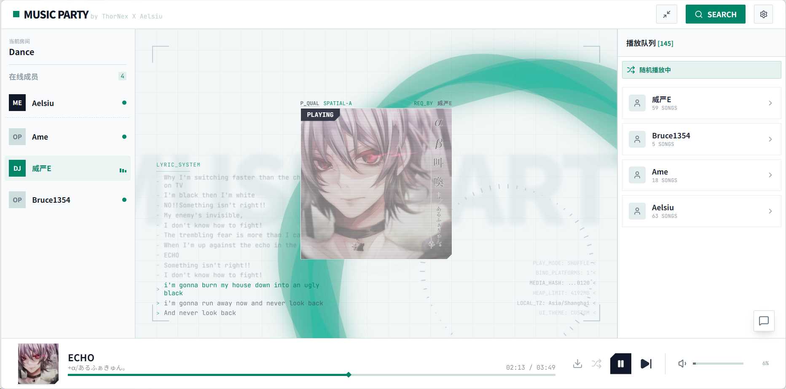

#  Music Party 
> 一个高颜值的实时在线听歌Web应用。
>
> 本仓库 fork 自 [PluvIIter/MusicParty](https://github.com/PluvIIter/MusicParty)。上游项目参考自 [EveElseIf/MusicParty](https://github.com/EveElseIf/MusicParty)。
> 
> [上游演示地址](https://music.thornex.uk/)  [上游视频演示](https://www.bilibili.com/video/BV1LCVJ6QEmk)（演示内容不一定包含本 fork 的改动）

***

   

**Music Party** 是一个开源的、私有化部署的多人实时在线WEB听歌平台。

它允许你和朋友在多个独立房间内，通过 **网易云音乐** 或 **Bilibili** 搜索并点播歌曲，同一房间的播放进度实时同步，房间之间的队列、聊天、配置与 Cookie 独立

（本项目并非“破解版”，对于VIP歌曲/高音质等会员内容，需要具有相应资格账号的cookie来获取，下方有获取cookie的教程）

本 fork 版本截图：



## 本 fork 相对上游的主要改动

* **房间与身份**：通过许可创建和管理房间，每个许可最多创建 9 个自己的房间，成员使用四位动态配对码进入，昵称和平台绑定共享，原有播放界面与功能继续复用
* **部署与配置**：Docker 和 Windows 启动器读取服务端最高许可配置，普通许可清单及多房间 SQLite 持久化分别保存，网易云支持二维码登录与手动 Cookie 更新
* **歌单与绑定**：设置中可分别绑定、解绑网易云和 Bilibili 用户；歌单支持多选导入和本地模糊筛选，筛选支持中文拼音及日文假名罗马音。
* **播放与音质**：网易云音质增加“高清臻音”；封面左上角的 `P_QUAL` 显示接口返回的实际播放档位。歌词可提前显示 0、1 或 2 行，音量百分比可直接输入。
* **外观**：提供白橙、暗橙、白蓝、暗蓝、白绿、暗绿六种预设，并可选择白/暗基调与主题色生成自定义配色。

## 核心特性

*   **多平台支持**：
    *   **网易云音乐**：支持搜索、歌单导入。
        * 网易云的API实现依赖[NeteaseCloudMusicApi](https://github.com/NeteaseCloudMusicApiEnhanced/api-enhanced)。
    *   **Bilibili**：支持搜索、收藏夹导入。 
        * 注意：b站源由于防盗链问题，方案是先下载本地缓存，然后由服务器将音频提供给用户，可能会占用较多网络带宽，消耗大量流量。
        * 此外，b站源风控现象严重，极不稳定，建议能用网易云就用网易云。
*   **精准同步**：基于 WebSocket (STOMP) 的状态分发，结合前端追帧，实现播放状态、进度、歌单、歌词的实时同步。
*   **响应式设计**：完美适配 PC 宽屏与移动端；支持媒体会话锁屏控制，移动端推荐『添加到主屏幕』以启用 PWA 后台播放。
*   **房间权限**：四位配对码每整十分钟同步更新，管理资格由独立许可控制，最高许可可以配置普通许可
*   **实时互动**：内置聊天室、点赞动效、系统日志广播。
*   **智能队列**：实现“公平随机”算法，防止单人霸榜。
*   **私人电台 / 私人DJ**：接入网易云推荐，支持私人FM 持续推歌与私人DJ（AI 语音点评+歌曲）两种模式。
*   **直播音频流**：可以开启直播音频流，使用一个简单的链接来实时收听，用于类似于vrChat等类似场景。

## Docker 部署（推荐）

本分支从源码构建多房间版本，启动配置样例为 `config/application.properties.example`，完整说明见 [多房间部署文档](docs/multi-rooms-deployment.md)，首次运行必须直接编辑文件配置最高许可

### 使用 Docker Compose 一键启动

安装 Docker Engine 和 Docker Compose 插件后，在仓库根目录执行

```bash
cp config/application.properties.example config/application.properties
# 编辑 app.rooms.root-key 为自己的 8–16 位 ASCII 可见字符密钥，并配置外部访问地址
docker compose up -d --build
```

启动后访问 `http://服务器IP:8848`，将 `app.music-api.base-url` 设置为实际访问地址，两秒内点击 `SECURITY ACCESS` 五次可验证许可并进入 `MANAGE`

网页保存房间配置和 Cookie 后立即生效并写入 SQLite，最高许可只在服务端文件中更换，更换后重启，普通许可通过最高许可管理界面新增、更新、删除

### 旧版环境变量说明

以下环境变量提供新房间的默认参数，已有房间的配置从 SQLite 恢复，Cookie 在各房间管理台配置，旧版 `ADMIN_PASSWORD`、`NETEASE_COOKIE`、`BILIBILI_COOKIE` 不再作为全服凭据使用，完整配置见示例文件

| 变量名                       | 必填 | 说明                                                                          |
|:--------------------------|:---|:----------------------------------------------------------------------------|
| `APP_AUTHOR_NAME`         | 否  | 页面显示的作者名字，地点在左上角标题后面。默认为 `ThorNex X Aelsiu`。                                |
| `APP_BACK_WORDS`          | 否  | 中间专辑封面后方的装饰性背景字，强制大写。默认为 `MUSIC PARTY`。                                     |
| `NETEASE_ENABLED`         | 是  | 网易云源是否开启。                                                                   |
| `NETEASE_API_URL`         | 是  | NeteaseCloudMusicApi 的地址，Docker 部署时默认为 `http://netease-api:3000`。           |
| `BASE_URL`                | 否  | 服务的域名（带协议）。用户获取直播流链接时，拼接在前面。默认为 `http://localhost:8848`。                    |
| `BILIBILI_ENABLED`        | 否  | B站源是否开启。                                                                    |
| `NETEASE_QUALITY`         | 否  | 网易云请求音质。可选：`standard`, `higher`, `exhigh`, `lossless`, `hires`, `jyeffect`（高清臻音）。默认 `exhigh`；实际播放档位以页面 `P_QUAL` 为准。 |
| `QUEUE_MAX_SIZE`          | 否  | 播放队列最大长度，默认 `1000`。                                                         |
| `QUEUE_HISTORY_SIZE`      | 否  | 播放历史记录保留数量，默认 `50`。当播放列表里没有音乐时，会从历史记录随机抽选。                                  |
| `QUEUE_MAX_USER_SONGS`    | 否  | 单个用户在队列中允许的最大点歌数量，默认 `100`。                                                 |
| `PLAYLIST_IMPORT_LIMIT`   | 否  | 导入歌单时的最大歌曲数限制，默认 `100`。                                                     |
| `CHAT_HISTORY_LIMIT`      | 否  | 聊天历史记录保留数量，默认 `1000`。                                                       |
| `CHAT_MIN_INTERVAL`       | 否  | 聊天发言最小间隔 (毫秒)，默认 `1000`。                                                    |
| `CHAT_MAX_LENGTH`         | 否  | 单条聊天消息最大长度 (字符)，默认 `200`。                                                   |
| `CACHE_MAX_SIZE`          | 否  | 本地音乐缓存上限，默认 `1GB`。支持格式如 `512MB`, `2GB`。                                     |

许可与配对码认证使用全服统一的失败尝试限制，同一来源一分钟内最多尝试 10 次，成功验证会清除失败计数，旧版 `AUTH_*` 参数不再控制多房间认证

---

## Windows 启动器

本分支的启动器已适配多房间配置与新版 NCM 运行时，可以通过 `build-local.ps1` 构建，首次运行需直接编辑 EXE 同目录的 `config/application.properties` 配置最高许可，详见 [多房间部署文档](docs/multi-rooms-deployment.md)

上游旧版 Releases 的启动器不包含本分支的改动，本次修改尚未发布新的安装包

---

## 房间、许可与配对码

许可验证后可以创建房间，房间名支持 2–16 个可见字符、中文及 emoji，允许重名，身份由唯一房间 ID 确定

房主在管理台查看动态四位配对码，所有房间每整十分钟同步更新，旧码冷却 30 分钟，当前周期内刷新、重开和重连免重复验证，保持连接的成员不受更新影响

本地记忆的 ID 仅作预填，入房时换填其他 ID 会作为新用户加入。若只需改名，请使用原 ID 入房后在在线成员列表修改，服务器确认后会更新本地记忆。

本版本从空数据开始，不迁移旧版队列和聊天记录，也不删除旧文件，使用独立的 `data/multi-rooms.sqlite`

最后一个成员离开后保留 10 秒重连缓冲，到期暂停播放、停止转码并断开直播，重新进入后手动播放，直播收听者不算在线成员

---

## 用户歌单
在“设置 → 绑定用户”中可以分别搜索并绑定网易云和 Bilibili 用户，绑定卡片会显示头像、用户名，也可以随时解绑。新 ID 首次入房时会清除该浏览器保存的旧绑定。搜索页面的歌单列表也保留 `UNLINK` 快捷解绑入口。绑定后可查看歌单或收藏夹，并通过 `ADD ALL` 导入全部歌曲，或勾选歌曲后通过 `SELECTED` 导入已选歌曲。两个导入按钮共享固定宽度，`ADD ALL` 默认展开，鼠标移到 `SELECTED` 或用键盘聚焦时由它展开。

歌单内的筛选框支持歌曲名和歌手名的文字、中文拼音，以及平假名和片假名的罗马音匹配；日文汉字词的读音不在支持范围内。筛选时会加载歌单剩余分页以覆盖整张歌单。

只有当前 Cookie 对应的账户才能查看自己的隐藏歌单或收藏夹，无法查看其他账户的隐藏内容。（可用此方法判断 Cookie 是否有效。）

## 个性化设置与播放界面

“设置”分为“主题”“绑定用户”“其他设置”三张卡片。主题卡片提供六种预设和自定义配色；自定义配色可选择白/暗基调和主题色，预览基调、主题、边框、背景色，点击“应用”后以波纹动画切换。其他设置可选择提前显示 0、1、2 行歌词，并可开启默认关闭的“可视化”，让背景丝带和环形柱状频谱随当前音频舞动。频谱分析在浏览器本地进行，动画限制为 30 FPS；音源不支持频谱读取时会自动恢复普通播放。

播放界面的音量百分比可点击输入，按回车确认后滑条会同步更新。网易云接口返回可识别的实际音质档位时，歌曲封面左上角会显示 `P_QUAL`：`STQ`（标准）、`HQ`（较高）、`EQ`（极高）、`SQ`（无损）、`HI-RES`（高解析度）、`SPATIAL-A`（高清臻音）。实际档位可能与管理员请求的音质不同，取决于接口返回结果。

---

## 聊天框命令

在前端**聊天窗口**中可以输入以下命令：
*   `//clear`: 从播放队列中清空自己点播的所有歌曲。
*   `//stream`: 获取自己的直播流链接（需要开放直播流）。
*   `//admin`: 打开本房间管理面板，已验证所属许可或最高许可时免重复验证

---

## 随机播放
随机播放是本项目的一个重点，为了保证所有成员的参与度，当开启随机播放时，将按照每个成员一首的方式轮替随机播放此成员点的歌。
如果希望完全随机，可以在管理员面板中切换，此外，也可以设置随机时是否会随机到不在线成员的歌曲。

---

## 投票切歌
管理员面板可以开启投票切歌，开启后，只有当选择切歌的人数超过设置的阈值比例后才会切歌，此外，也可以设置在歌曲播放的前多少秒内无法投票。

---

## 置顶
在按成员轮替的随机播放中，播放列表会按成员分组，此时置顶逻辑有所变化。第一次点击置顶后，歌曲只会在该成员的列表中置顶，即轮替到该成员时，此歌曲优先播放。
对已经置顶的歌曲再次点击置顶，才会全局置顶，即无视轮替，下一首 必定是指定歌曲。

---

## 点赞
播放时，点击中间的封面可以对当前歌曲点赞，会有对应的视觉效果。
在搜索页面的LIKESONG选项卡下可以看到所有点赞的歌曲，可以重新添加到播放列表或者前往源页面。
注意记录的点赞歌曲是本地保存的，清理浏览器缓存丢失记录。

---

## 私人电台 / 私人DJ
在管理员面板的"私人电台"模块开启后，可以接入网易云的推荐内容。

**两种模式**（可随时切换）：
*   **私人FM**：根据账号的收听习惯持续推荐歌曲。
*   **私人DJ**：由 AI 主播语音点评/介绍歌曲，**先播放语音、再播放歌曲**。

**三个功能开关**：
*   **填充空白**：当播放队列没有有效歌曲时，不再从历史记录随机抽选，而是播放私人FM/DJ。
*   **加入队列**：仅**随机播放**模式下生效，让私人FM 参与随机池——普通随机下它是一首"播完立即重新加入"的歌，公平随机下它被视为一个用户参与轮替。此功能**固定使用私人FM**，不应用私人DJ。
*   **播放托管**：完全无视播放队列，只持续播放私人FM/DJ（期间点歌照常入队，关闭托管后接续播放）。

---

## 管理员面板
在聊天窗口输入 `//admin` 可以进入当前房间管理台，普通成员需要验证该房间所属许可或最高许可，入房前已验证的管理资格可以直接复用

* 修改当前房间的配置参数
* 锁定播放，切歌，随机按钮以防止用户滥用。（建议保持播放按钮锁定，防止某一个用户因为卸下耳机等行为导致的自动暂停）
* 随机播放与投票切歌相关配置。
* 配置私人电台/私人DJ。
* 开关直播流功能。
* 更新歌曲源的凭证，或是启停歌曲源。
* 对播放列表或者聊天记录进行清理。
* 重置当前房间的播放与队列

---

## 历史记录
播放过的歌曲会被加入历史记录，当没有歌曲播放时，会随机从历史记录中播放歌曲。

---

## 闲置
当没有任何成员连接时，播放会自动暂停。如果该状态保持20分钟，由于网易云的歌曲链接有时效，当前歌曲播放状态将被清空。

---

## 直播流链接获取
1. 确保已经管理员已经在管理员面板启用了直播流。
2. 在聊天窗口中输入`//stream`
3. 切换到系统日志窗口，即可看到自己的直播流链接。
#### 注意，直播流使用FFmpeg，会占用更多性能，且有大量流量消耗。

---

## Cookie凭证获取

在房间管理台点击网易云 `获取 Cookie`，使用网易云音乐 App 扫码并确认登录，服务验证成功后将 Cookie 保存到当前房间，以下手动方式仍可使用
* **网易云**
浏览器打开网易云音乐，登录，按F12开启控制台，选择网络，然后点击我的音乐，在控制台中寻找playlist开头的请求，然后找到Cookie，将所有内容复制。


* **bilibili**
浏览器打开bilibili，登录，进入我的收藏页面，按F12开启控制台，选择网络，然后收藏夹翻页，在控制台中寻找list开头的请求，然后找到请求头中的 Cookie，将所有内容复制。


---

## 本地开发指南

### 前端 (music-party-web)

1.  环境要求：Node.js 22 或以上
2.  进入目录并安装依赖：
    ```bash
    cd music-party-web
    npm install
    ```
3.  启动开发服务器：
    ```bash
    npm run dev
    ```
4.  配置代理：`vite.config.js` 默认将 `/api` 和 `/ws` 代理到 `http://localhost:8080`。

### 后端 (Java)

1.  环境要求：JDK 21, Maven 3.x, 并已部署Netease Cloud Music Api。
2.  配置：复制配置样例到 `config/application.properties` 并设置 `app.rooms.root-key`，配置网易云 API 地址，Cookie 在房间管理台配置
3.  运行：
    ```bash
    mvn spring-boot:run
    ```

### 完整构建

建议直接使用 Docker 镜像进行生产环境运行。构建镜像请参考根目录下的 `Dockerfile`。

---

## 免责声明

*   本项目仅供学习交流使用，请勿用于商业用途。
*   本项目涉及的第三方 API（网易云音乐、Bilibili）均为非官方接口，项目开发者不对 API 的可用性及账号风险负责。
*   请尊重版权，支持正版音乐。

---

## 贡献

欢迎提交 Issue 和 Pull Request！无论是修复 Bug、新增功能还是优化文档。

## License

MIT License
